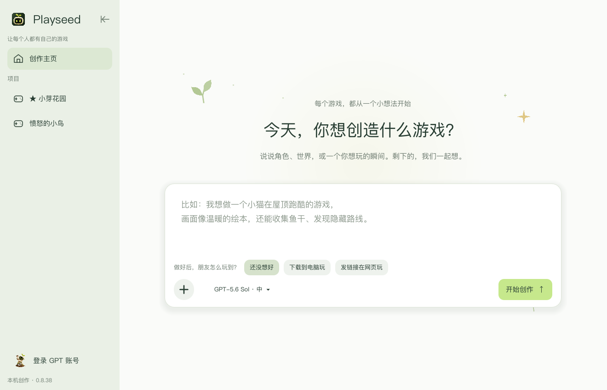

# Playseed

**English** | [简体中文](README.zh-CN.md)

Current repository version: **0.8.53**

<p align="center">
  
</p>

Actual creation-home screenshot from 0.8.38. The source is now 0.8.53: web 2D and experimental Three.js 3D games can be created and played locally in a browser. Hosted public links are not connected yet.

**Make game creation approachable, so everyone can have a game of their own.**

Playseed is a local macOS AI game-creation prototype for people without programming or game-development experience. Describe an idea in Chinese, clarify the first playable version, prepare assets, create and play the game, then keep improving it through the same conversation. Each accepted version can be restored or exported.

Small native 2D games are the main supported scope. Native 3D room-exploration games are experimental. Web 2D and experimental Three.js 3D generation run in a local browser; public sharing is not connected yet. See [current capabilities and limits](docs/04-当前能力与边界.md) and the [roadmap](docs/05-路线图.md).

## What you can do

- **Develop an idea through conversation:** clarify vague ideas or turn a sufficiently clear request directly into a first-version plan.
- **Confirm before building:** keep the plan, approval, asset preparation and production checklist as separate states.
- **Prepare assets:** import reference images, generate individual image drafts, remove backgrounds, work with grid-based sprite animation, import WAV audio and preview static 3D props.
- **Create and play:** generate a small native Godot game or a browser game, inspect its opening preview and launch a separate playtest window.
- **Iterate without losing a playable version:** describe changes, inspect a new version, restore an earlier version or export the complete Godot or web source project.
- **Manage local projects:** choose a project folder, pin projects, rename them and delete them with folder-safety checks.

## Build from source

The repository includes source, tests, brand assets and documentation. The application bundle, personal games, `.playseed/`, exports and temporary files are generated locally and are not included in Git.

Requirements:

- macOS, Python 3.11 and Xcode Command Line Tools.
- An installed Godot runtime; the documented development runtime is Godot 4.7.2.
- Codex CLI, signed in on the Mac with the account used for model calls.
- Node.js and Google Chrome for local browser-game verification; install the locked JavaScript dependencies with `npm ci`.
- Blender for optional static-prop creation; macOS 14 or later for local background removal.

```sh
git clone https://github.com/chenjieliefu/Playseed.git
cd Playseed
npm ci
python3 scripts/build_macos_app.py --runtime "/path/to/Godot.app/Contents/MacOS/Godot"
```

Replace the runtime path with your actual installation. This is a local development prototype: dependencies and runtime paths need checking on another Mac. The app is not a notarized, ready-to-distribute installer.

## Create your first game

1. Open the locally built `Playseed.app`.
2. Describe your game on the creation home. Use **＋** to add references or choose an empty project folder. The delivery choices record how you want friends to play: undecided, a downloaded game or a web link.
3. Select a supported GPT model and reasoning level, then start creating.
4. Select or create an empty folder for this game.
5. Clarify and confirm the first-version plan, prepare assets and a production checklist, then build.
6. Once the corresponding Godot or browser checks pass, open the separate playtest window. Return to the same conversation to request changes.

The product interface is currently in Simplified Chinese. Model availability and supported settings are documented in [current capabilities](docs/04-当前能力与边界.md).

## How it works

| Component | Responsibility |
|---|---|
| GPT through the local Codex CLI | Understand ideas, structure plans, write or modify game logic |
| Godot | Run the desktop interface and native games, render previews and process real input |
| Python | Orchestrate model calls, validate candidates, isolate playtests and save versions |
| Chromium and Three.js | Isolate browser playtests and render web 3D games |
| Blender | Optional static-prop creation for supported native games |

A candidate must pass static restrictions, engine-specific parsing, isolated startup, a core-action state-change check and a restart check before it becomes a new version. Native games use Godot; web games use an independent Chromium sandbox. The new web host also verifies pause/resume and two restart-and-replay cycles using actual controls. Gesture-only games use a simulated camera and synthetic hand landmarks through the production input path; this does not validate real-person tracking quality. Failed candidates can receive up to two automatic repair attempts. Passing these checks does not establish that a game is fun, visually polished or correct for every possible interaction.

See the [system architecture](docs/03-系统架构.md) for the full call chain.

## Assets and experimental 3D

Images can be attached to the conversation or added to the project library. Generated image drafts are previewed and explicitly accepted before use. For native 2D games, WAV audio can be imported, previewed and applied to a later game version, with source information, volume settings and version snapshots.

Experimental native 3D supports geometric rooms, movement and collision, item collection, exit conditions and static base-color GLB props. After confirming a plan, a request beginning with `生成模型：` can create a basic Blender prop draft for preview and acceptance. More complex native 3D gameplay, textures, skeletal animation, jumping, combat and 3D audio are outside that room-exploration scope. The separate experimental web 3D path supports procedural scenes, combat, reusable character/effect components, synthetic audio and optional hand gestures. Imported audio and GLB models are not yet connected to web games.

## Validation and examples

The published capability record reports **149 Python checks**, plus Godot interface, game and input regressions. Fixed validation samples cover platforming, shooting, management, puzzle and tower-defense games, including three revision rounds per genre and automated playthrough/restart checks. Web fixtures additionally cover 2D/3D creation, three edits and restore, repair-context preservation, pause/resume, repeated play and legacy-runtime compatibility. These are development samples, not general success-rate or user-experience claims.

[验收游戏](验收游戏/) contains validation screenshots and launcher descriptions. The launchers depend on the original local validation projects; cloning the repository alone does not make those historical samples playable. See [beginner playtest and acceptance notes](docs/11-新手试玩与体验验收.md).

```sh
python3 -m unittest discover -s tests -v
"./Playseed.app/Contents/MacOS/PlayseedRuntime" --headless --path app --script game_tests.gd
"./Playseed.app/Contents/MacOS/PlayseedRuntime" --headless --path app --script input_tests.gd
"./Playseed.app/Contents/MacOS/PlayseedRuntime" --headless --path app --script creator_tests.gd
```

Rebuild an existing local app with `python3 scripts/build_macos_app.py`.

## Local data

Games, assets and versions live in the folder selected for each project. Conversations, plans and task logs live in this checkout's `.playseed/` directory. Playseed uses the existing local Codex CLI login and does not store the user's account password.

The current design is a local, single-user prototype. Hosted public links, multiplayer, cloud multi-user execution, billing and one-click player distribution are not available in this version. Individually redesigning and reliably replacing assets in an existing game remains ongoing platform work.

## Code and documentation

| File | Purpose |
|---|---|
| `app/creator.gd` | Main interface and interaction states |
| `backend.py` | Local jobs, model calls and request dispatch |
| `creator.py` | Conversation, plans, confirmation and production checklists |
| `producer.py` | Native generation, Godot validation and dispatch by delivery format |
| `web_games.py` | Web generation, repair context, browser checks and immutable versions |
| `runtime/web/` and `scripts/web_runner.mjs` | Trusted web host, components, hand input and isolated validation |
| `resources.py` | Image assets, animation/effect helpers and export |
| `audio_assets.py` | Audio validation, source information, volume and snapshots |
| `project_ops.py` | Pinning, renaming and deletion |
| `scripts/build_macos_app.py` | Local macOS application build |

Start with the [documentation index](docs/README.md), then read the [product definition](docs/01-产品定义.md), [creation flow](docs/02-用户创作流程.md), [architecture](docs/03-系统架构.md), [capabilities](docs/04-当前能力与边界.md) and [roadmap](docs/05-路线图.md). Detailed product documents are currently in Chinese.

Historical research in `research/` is evidence of past investigations, not the current product specification. Contributors and coding agents should start with [AGENTS.md](AGENTS.md).
