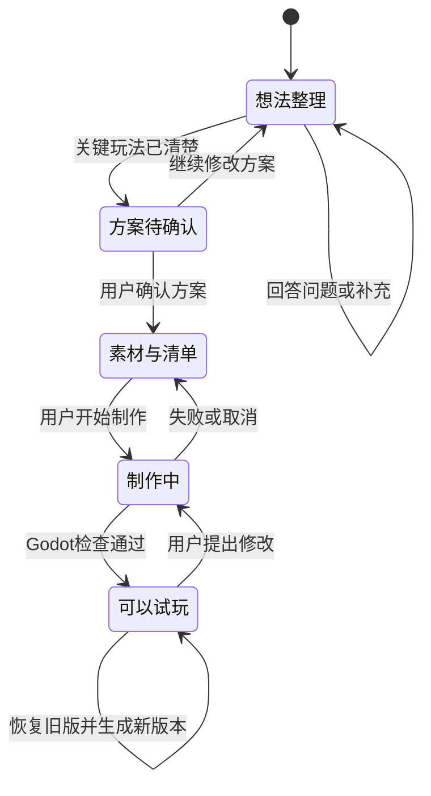

# 用户创作流程

## 主流程

| 阶段 | 用户操作 | Playseed 的工作 | 产生的真实结果 |
|---|---|---|---|
| 1. 说出想法 | 在创作主页输入一句话，可添加参考图，选择 GPT 模型和思考强度 | 保存原始想法；检查 GPT 登录状态 | 尚未生成游戏 |
| 2. 选择项目文件夹 | 选择或新建一个空文件夹 | 将项目编号与该文件夹绑定，写入安全标记 | 独立的游戏项目位置 |
| 3. 理清想法 | 回答一至两个关键问题，或补充自己的想法 | 清晰需求直接整理方案；模糊需求逐轮澄清 | 可继续修改的游戏方案 |
| 4. 确认第一版 | 检查角色、目标、核心玩法、画面和首版范围 | 固定当前方案版本 | 已确认方案，仍没有游戏 |
| 5. 准备素材与清单 | 决定素材由平台设计、自己上传或暂用临时形象 | 记录素材来源，将玩法、画面、反馈和验收拆成清单 | 素材库和制作清单 |
| 6. 制作游戏 | 点击开始制作，也可以暂停 | GPT 编写完整 GDScript；后台创建 Godot 工程并检查 | 检查通过的新游戏版本 |
| 7. 试玩 | 打开独立试玩窗口，完成一轮游戏 | Godot 在隔离进程中运行当前版本 | 用户的实际体验反馈 |
| 8. 继续修改 | 在同一个聊天框描述要改的地方 | 基于当前代码和确认方案生成完整新脚本，再检查和保存 | 新版本及修改说明 |
| 9. 恢复或导出 | 选择旧版本或导出工程 | 恢复会产生一个新版本；导出完整 Godot 源工程 | 可追溯版本或 ZIP 文件 |

## 需求清楚与模糊时的分支

用户已经说明主要角色、反复进行的动作、目标和胜负条件时，Playseed 直接整理第一版方案，避免为了提问而提问。

用户只说“小猫冒险”“想做一个治愈的游戏”时，Playseed 每轮只问一至两个会改变玩法方向的问题，例如“玩家主要做什么”“怎样算完成”。非关键细节可以由 AI 暂定，但必须标记为暂定。

## 素材分支

当方案需要具体角色或场景时，用户可以选择：

- Playseed 自动设计：确认方案后，在聊天里点击“描述要生成的图片”，或发送“生成图片：”加描述。每次生成一张，先预览，再采用、放弃或调整描述重试。采用才会进入素材库；不会立即修改游戏。
- 用户提供：通过聊天框“＋”上传 PNG、JPG 或 WebP，导入项目素材库。
- 临时形象：先用程序绘制或简单占位完成玩法，后续再替换。

发送消息后，模型会收到真实图片附件及名称、用途和编号，先说明看见了什么，再结合需求安排用途。每轮最多六张：本轮新上传优先，其次是消息里点名的图片，再补最近导入的图片；素材区“添加到对话”会带上准确编号。首页首次附件、项目后续讨论、制作、修改和自动修复使用同一条图片输入链路。

导入只保存素材，不自动改变游戏。用户确认方案并制作，或要求修改当前游戏后，原 PNG 才由生成脚本加载到场景中；通过检查后保存新版本。透明通道和宽高比应保留，实际摆放仍需看预览和试玩确认。多角色拼图不会自动切成角色，自动切图、动画帧与多张统一画风尚未接通。

## 状态推进规则

## 任务运行中可以做什么

一轮任务通常要等较长时间，等待期间界面不整体锁死，只锁真正会冲突的操作。

| 等待中的操作 | 是否允许 | 原因 |
|---|---|---|
| 返回创作主页、查看我的项目 | 允许 | 只是换页面，不影响正在跑的任务 |
| 继续在输入框里写下一条 | 允许 | 想法可以提前写好，等这轮结束再发 |
| 查看游戏方案、制作清单、版本历史、账号 | 允许 | 只读查看 |
| 点击发送 | 拒绝并提示“上一步还在进行” | 同一时间只跑一个任务 |
| 切换到另一个项目 | 拒绝并提示先“停止本次生成” | 换项目会让回来的结果落到错误的项目上 |
| 停止本次生成 | 允许 | 这是等待中的退出方式 |

被拒绝的操作必须给出可读提示，不能点了没反应。

## 输入框的键盘规则

聊天框和创作主页输入框都支持回车发送、Shift+回车换行，按钮提示里写明这一点。弹窗（方案、清单、版本历史、账号）打开时按发送，会先关掉弹窗再发送，不静默失败；按 Esc 关闭弹窗。

## 失败处理

- GPT 请求失败：保留输入、对话、方案和已有游戏。
- 生成代码检查失败：最多自动修复两次；仍失败则不发布新版本。
- 用户暂停：终止本轮任务，不继续自动制作。
- 预览图失败：已通过检查的游戏仍可试玩，不用缩略图失败冒充游戏失败。
- 项目文件夹不可用：停止写入，不改到其他目录。
- 旧窗口尝试覆盖新版本：通过方案版本号和游戏版本号拒绝提交。

## 项目管理

左侧项目支持置顶、重命名和删除。重命名同时修改项目名和项目文件夹名；删除同时删除记录、对话、素材、游戏和版本。删除前必须显示完整影响，并验证 `.playseed-project.json` 的项目编号，避免误删普通文件夹。

### 生成素材的真实状态

“生成中”不意味着成功；有效图片文件写入项目 `image-drafts/` 后才出现草稿卡片。“采用这张图片”会把图片和生成描述、来源、时间、尺寸保存到素材库。未采用的图片不会复制进游戏工程。可以继续使用现有制作或修改流程，把已采用的图片放入游戏，新版本仍需通过 Godot 检查。

生成失败、取消或方案在生成期间变化时，不提交新草稿；旧素材和游戏保留。调整描述后再次发送会消耗新一次账号额度，不会自动无限重试。每项目最多24张待确认草稿、素材库最多24张图片；可放弃草稿腾出待确认名额。旧方案的草稿不能直接采用，但可以放弃或按新方案重新生成。

## 实验性3D素材预览

在项目聊天发送“打开3D素材预览”，或素材区点击同名入口，在浏览器打开本地工具。调整简单道具或打开自包含GLB后，可导出到浏览器下载位置。该预览本身不会更新游戏版本，静态模型入场流程见下文。

0.8.10：预览中可以“保存到当前项目”，再回素材区点“刷新素材”看到3D道具。保存绑定打开时的项目，切换App项目不会改变浏览器的保存目标。项目移动或重命名后应关闭旧预览，重新从该项目打开。已保存的模型可从“模型素材与来源”补齐资料，再通过对话用于3D障碍。

### 主动停止与失败的区别（0.8.13）

方形按钮是“停止本次生成”：点击后等待后台确认停止，留在当前对话，已发送消息显示停止状态，输入框中的新草稿保留。可重新生成同一条，也可补充想法后发送；首次生成停止后仍沿用选择的文件夹。它不是冻结模型计算，重新生成是一次新请求。主动停止不走失败后返回首页、回填原输入的路径。

### 逐项素材入口（0.8.16）

方案确认后，在聊天中选择需要准备的素材条目。“平台生成”先把要求和方案画风填入输入框，用户可编辑后发送；“我提供图片”打开原生文件选择器，并把此项用途加入聊天草稿。已有草稿不会被生成入口覆盖。选择或上传不表示素材任务完成，平台生成仍需预览、采用；已有素材可以继续用于制作或修改，不会因进入这一界面而被替换。

### 选择素材对应关系（0.8.17）

从任务入口上传时自动关联，任务入口生成的草稿在采用后自动关联；普通上传或自由生成的图片可在对应条目下点击“关联已入库图片”选择；界面显示关联名称，后续对话和制作会收到该用途。换图可重新选择，解除关联保留图片。更新方案后需重新确认关联，避免旧图片用途被静默套用到新需求。关联不会自动启动制作，仍通过聊天描述修改并检查后形成新版本。

任务生成的采用按钮旁明确提示对应条目，以及替换已有关联时原图片会保留。放弃草稿不会修改关联；用户改变项目或方案后，需要重新从当前任务进入。

### 拆分复合素材需求（0.8.19）

选中一个原素材条目，点击“拆成单张图片任务”，等待模型整理建议。对话末尾显示每张图片的主体、用途和来源；确认后逐项准备，或点“保留原任务”放弃建议。已有图片和关联不会删除，不会自动生成图片或启动游戏制作。明确保留整张的图片可以继续按原任务处理。

### 选择生成画风参考（0.8.20）

在对话的“准备游戏画面”里，可从当前项目已入库图片选择一张“生成画风参考”，查看缩略图后再发送生图描述；默认“不使用参考图”。新参考图先通过＋上传。选择按项目和方案版本在本次App会话内记忆，不会传给普通讨论或直接修改游戏。

生成草稿显示参考来源，采用后保存来源记录；调整描述重试沿用该草稿的参考，旧方案重试清空参考。参考的是配色、笔触和光照，不等于复制角色，也不保证结果完全一致。角色或道具草稿如果没有透明像素，会提示检查底色；仍由用户预览、采用或放弃。

### 透明背景修复（0.8.21）

不透明草稿可点击“生成透明背景修复稿”，会用账号额度发起一次图片编辑。原稿保留，修复稿另存，需重新预览采用；失败不替换已有素材和游戏。不透明修复稿不能采用，可再次修复、放弃或自己上传。即使检查到了透明像素，也请确认主体完整、边缘干净。普通完整背景图片仍可照常采用。

### 本机去背景（0.8.22）

在图片草稿下选择收边程度，点击“本机去背景”，不使用GPT额度。新稿可切换深浅底色检查，确认后采用；原稿和游戏不变。收边越强越可能损失细节，默认不收缩。macOS系统组件不可用时提示失败，仍可使用已有图片或自行上传。

### 素材细节审阅（0.8.23）

本机去背景增加默认关闭的“清理浅色残边”；处理稿可切换原稿对照，并通过“放大检查处理结果”在系统图片查看器放大检查。先看深浅底色、主体完整性，再决定采用。具体要求见[素材质量标准](08-素材质量标准.md)。

0.8.24清理浅色残边若可能明显误删主体，会停止保存并提示关闭清理后重试。用户仍可查看原稿，失败不会产生可采用的新稿。

### 帧动画与画风（0.8.25）

规则帧图可在素材区配置，也可通过中文格式化对话设置；预览保存后，再发送用途说明制作新游戏版本。完整操作见[帧动画使用与验收](10-帧动画使用与验收.md)。美术方向跟随当前方案，不默认写实；用户不明确时对话澄清或标注暂定选择，角色、背景和道具保持一致。

## 首次创建与立即停止（0.8.30）

选好空文件夹并发送后，本地服务先保存第0版项目草稿、第一条用户消息、项目文件夹标记及首轮附件，再调用AI。侧栏通过任务中的项目创建回执及时刷新。即使停止先于AI调用，也保留本地草稿；停止只中断生成。草稿不表示方案完成，不能直接制作游戏。重新打开项目可点击“继续整理方案”，复用同一项目和已保存的首条消息，成功后形成第1版方案，不重复添加首条消息。

## 声音素材与音量（0.8.31）

在右侧“素材”里打开“声音素材与音量”，选择普通16位PCM WAV（单/双声道、8～48 kHz、单个16 MB和3分钟以内），选择音效或背景音乐，填写来源和授权依据后导入。每项目最多24个声音；同一内容重复导入保留原用途与来源。试听和停止试听可直接操作；来源由用户提供，平台不自动验证授权。

点击“添加到对话”后说明播放时机，发送以制作或修改游戏。已有输入草稿不会被覆盖。模型只收到声音的名称、用途和来源，不会收到可听附件，不能声称已经听过。入库尚不代表已用于游戏；新版本依然要通过原有制作检查。音乐生成、配音和MP3/OGG/AAC导入尚未接通。

声音相关的三个状态分别是：

- **声音素材**：项目里已导入且可试听的声音，不代表游戏已经使用。
- **版本默认音量**：制作或修改时保存到新版本的音乐、音效初始音量；在素材窗口保存的新设置只影响下一版。
- **试玩音量**：游戏右上角“声音”里调节的本次音量，调到0为静音；重开保持，关闭试玩后不保存。它不会改写版本默认音量。

游戏的声音通过真实事件触发；重开停止旧音效并重新开始背景音乐，不叠加播放器。恢复旧版取回该版本的声音文件、来源和默认音量，库中后来导入的声音保留供后续创作。完整源工程ZIP包含这些文件。

## 实验性3D房间寻物（0.8.32）

**实验性3D房间寻物**指在一个小型三维房间里行走、绕过实体障碍，靠近拾取物品，收集齐后到出口完成的可玩范围。它不同于只查看模型的“3D素材预览”，也不代表任意3D游戏制作已开放。

先在对话里说明3D房间的主题、要找的物品、出口目标，并明确使用几何体临时形象或已入库的静态障碍模型。确认方案、准备素材和制作清单后，在制作按钮下选择“实验性3D · 房间寻物”，再开始制作。选择按项目保存在本机，重开App后仍保留。保存失败时恢复原选择并明确提示。已有游戏保持原制作方式，2D/3D项目不能直接互相转换。

支持WASD/方向键行走，靠近按E交互，R完整重开，Esc暂停。角色具有实体碰撞，远处或隔着障碍不能拾取，物品没齐时出口不放行。相机固定俯斜显示，不锁鼠标。当前没有跳跃、战斗、自由相机、骨骼或3D声音；如这些是原方案核心，制作会解释不支持，不能悄悄改为寻物。

试玩后仍在同一聊天框描述修改，形成新版本；旧版恢复会新建版本，导出提供完整源工程。几何体的名称、颜色、位置和数量由方案生成，不能把它当作已经使用图片或模型库里的素材。

## 静态模型入场（0.8.33）

在项目右侧“素材 → 模型素材与来源”选择本地GLB，填写名称、用途、来源和授权依据后导入。模型以文件内容编号去重；再次导入不会悄悄改写已填来源，资料变更需点击“编辑资料”。旧预览工具保存的模型也会出现，使用前需补齐资料。

“重新预览”打开该模型原文件；“添加到对话”只填入建议，不自动发送，也不覆盖已有草稿。先说明替换哪个障碍，再制作新版本。AI读取模型资料和编号，不代表已看过模型外观。导入和编辑资料都不会直接改变游戏。

当前仅支持20MB以内、最多20万实例顶点的自包含静态三角面GLB、基础不透明颜色；不支持贴图、压缩扩展、骨骼和动画。模型只替换障碍外观，等比缩放到障碍外盒并贴地；可见底座标示整块盒形碰撞范围，镂空处暂不能穿过。角色和拾取物仍为几何体。

采用的原始模型文件与当时资料随版本保存。恢复使用旧快照；恢复无模型版会移除模型。源工程导出包含该版使用的GLB与资料，不包含未使用的模型库。

## Blender道具草稿（0.8.34）

确认方案后，在聊天发送“生成模型：”加道具描述，或从“素材 → 模型素材与来源 → 描述道具，用Blender制作”预填请求。入口不会覆盖输入框已有草稿；点击发送才开始。需要本机“应用程序”中已安装Blender，未找到时先说明，不发起付费模型请求。

首轮只制作由方块、圆柱、圆锥和低面数椭球组成的基础色静态道具，最多24个部件；不支持精细人物、贴图、文字雕刻、骨骼和布尔镂空。AI规划造型，Blender后台生成GLB、可编辑源文件和正背面斜视图，再通过静态及Godot检查。生成期间可以停止，未完成结果不会显示为可采用。

两个角度的草稿出现在对话中。检查形状、配色、连接和接缝后点击“采用模型”；不满意可“改描述重做”或“放弃草稿”。重做先预填原描述，用户修改并发送；原稿保留，采用不会自动更新游戏。方案更新后，旧草稿不能采用，但可以放弃。采用后从模型素材区添加到对话，指定用于哪个障碍，再制作新版本。

模型草稿连同生成描述、造型数据、Blender版本、源文件和图片保存在项目中。文件检查不证明美术合格；明显分离的部件会拒绝，曲面是否真正相接、共面黑缝和造型是否符合预期仍需查看。

## 失败、取消与重试（0.8.37）

对话、制作清单、2D/3D生成和修改、版本恢复、图片或模型生成失败/取消后，同一项目中可“重试这一步”，保留原操作和参数；不会自动重试或消耗额度。已有下一条输入草稿时不覆盖；输入为空时可取回失败文字继续编辑。方案或游戏版本已变化时重试禁用，需按当前项目重新选择。删除、导出、素材采用等操作不套用该重试入口。重试卡片目前保留在当前会话；重开后项目和已有版本仍可打开，但需重新选择失败的操作。
