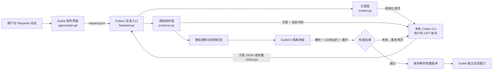

# 系统架构

## 核心结论

Playseed由GPT负责创作、Python负责项目与版本编排；Godot运行桌面界面与本机游戏，Chromium运行网页游戏，Three.js负责网页3D。

- **GPT** 理解用户想法、整理结构化方案，并为已确认方案编写Godot脚本、实验3D场景数据，或网页JavaScript。
- **Godot** 是实际的游戏引擎，负责 Playseed 桌面界面，以及本机交付游戏的场景、渲染、输入、动画和运行。
- **Python** 是本地编排层，负责调用 GPT、校验返回、创建工程、启动 Godot 检查、隔离试玩、保存项目和版本。

当前应用内置的 Godot 运行组件版本是 `4.7.2.stable`。项目使用 Godot 的运行程序，但没有修改或重新编译 Godot 源码。

## 两条产品线与运行时分工（0.8.39）

产品先记录用户期望的玩的方式（`delivery`：web / native / 未定），再按画面维度进入不同制作路径：

- **本机线（下载到电脑玩）**：现状主链路，Godot 运行。2D 由 GPT 写完整 `game.gd`；实验性 3D 由 GPT 输出 `world.json` 场景数据、宿主提供可信运行器。Blender 按需为素材层生产 GLB，不进入默认链路。
- **网页线**：0.8.40接通本机浏览器制作、试玩、修改、恢复和静态工程导出；公开托管未接通。网页2D使用画板，3D使用固定本地Three.js模块。GPT只生成game.js，可信boot.js负责主循环、输入与重开；web_games.py负责候选版本和提交，scripts/web_runner.mjs负责静态检查、本机文件服务与独立Chromium运行。
- **素材层与方向无关**：图片、声音、GLB 的入库、快照、版本复制逻辑由两条线共用；Blender 永远只服务素材层。
- **界面只问人话**：主页只问“怎么玩到”与画面维度，不把引擎选择暴露给用户；`delivery` 保存在 idea 中，新项目据此选择网页或本机制作，已有项目始终保持原格式。

## 一次制作请求如何运行



## 三层职责

| 层 | 主要文件 | 职责 |
|---|---|---|
| 产品界面 | `app/project.godot`、`app/creator.gd`、`app/workspace_resources.gd` | 首页、项目栏、对话、状态、工具区、预览和项目操作 |
| 本地编排 | `backend.py` | 任务锁、GPT 调用、模型参数、任务状态、取消、分发和错误保护 |
| 方案 | `creator.py` | 对话上下文、方案结构、澄清问题、确认状态、素材计划和制作清单 |
| 游戏生成 | `producer.py` | 生成完整 `game.gd`、创建 Godot 工程、检查、自动修复、预览、试玩和版本提交 |
| 素材 | `resources.py`、`runtime/playseed_base.gd` | 图片校验和导入、复制到版本、可信动画与特效辅助接口、工程导出 |
| 项目文件 | `project_ops.py`、`storage.py` | 项目置顶、重命名、删除与旧存储兼容 |
| 应用打包 | `scripts/build_macos_app.py`、`scripts/playseed_launcher.c` | 将 Godot 运行程序和 Playseed 图标封装为 macOS 应用，并启动 `app/` 工程 |

## Godot 实际参与了哪些环节

1. `Playseed.app` 启动内置的 `PlayseedRuntime`，读取 `app/project.godot`，因此整个 Playseed 窗口本身就是 Godot 应用。
2. 2D制作时，GPT 返回的是 GDScript，不是最终游戏程序。`producer.py` 另外创建 `project.godot` 和 `main.tscn`，把脚本挂到 `Node2D` 根节点。
3. 每个候选版本都用 Godot 做脚本解析和实际启动检查，并调用 `reset_game()`、`playseed_action()`、`playseed_snapshot()` 验证共同接口。
4. 右侧开场预览由 Godot 实际渲染成图片。
5. 用户点击试玩时，Godot 在独立进程里运行对应版本。
6. 导出的 ZIP 是完整 Godot 源工程，可用 Godot 继续打开。

所以，GPT 提供“理解和写代码的能力”，Godot 提供“把代码变成真正游戏的能力”。没有 GPT，当前产品不能自动理解和编写新玩法；没有 Godot，生成的脚本不能成为可渲染、可操作、可检查的游戏。

## 2D生成游戏的当前结构

每个新版本是一个完整目录，主要包含：

```text
revisions/0001/
├── project.godot
├── main.tscn
├── game.gd
├── playseed_base.gd
├── playseed_feedback.gd
├── assets/
├── preview.png
└── version.json
```

当前 GPT 主要生成一个自包含的 `game.gd`，宿主提供固定场景和可信辅助代码。这种结构适合验证小型 2D 游戏，尚不适合复杂多场景、多人联网或大型 3D 工程。

## 数据保存

```text
Playseed/.playseed/
├── ideas/<项目编号>/idea.json      # 对话、方案、状态和方案历史
├── ideas/<项目编号>/builds/        # 确认方案对应的制作清单
└── jobs/<任务编号>/                # 请求、状态、结果和排错日志

用户选择的项目文件夹/
├── .playseed-project.json          # 删除和重命名时的安全标记
├── game.json                       # 当前游戏版本及版本索引
├── library/                        # 用户导入的素材
└── revisions/                      # 每一版完整 Godot 工程
```

## 安全边界

GPT 生成的脚本先经过禁止 API 检查，再在 macOS `sandbox-exec` 隔离中运行。隔离进程禁止联网、禁止启动其他程序，并限制文件读写范围；GPT 登录凭证不会传给生成游戏。候选版本只在检查通过后原子替换为正式版本。

这是本机单用户原型的安全边界。未来迁移到多人云端时，必须换成面向多租户的服务端容器或虚拟机隔离。


## 图片如何交给模型（0.8.7）

`resources.model_images()` 从本轮附件和项目素材库选择最多六张图片，校验 PNG、尺寸、哈希编号和文件位置，再复制到任务的 `model-images/`。`backend.request_structured(images=...)` 只接受该任务目录内的 PNG，通过本机 Codex CLI 重复的 `--image` 参数传入；附件顺序与 `attached_images` 元数据一一对应。接口依据本机帮助及 [OpenAI CLI 图片参数文档](https://learn.chatgpt.com/docs/developer-commands?surface=cli)。

`creator.py` 负责方案阶段的图像理解，`producer.py` 在首次生成、修改和最多两轮修复中保留相同图片快照。`reference_images` 记录本轮送给模型的图片，不代表这些图片全部已被游戏使用；实际使用要检查场景和版本内素材。恢复旧版不调用模型，恢复原脚本和该版图片，并继承原记录。

图片里的文字只是素材内容，不作为用户指令。`has_alpha_channel` 只说明文件具有透明通道，不承诺已经抠图；提示模型不要把预览中的黑白底直接当成原图背景。图片内容理解仍可能判断错误，不能替代实际画面验收。


## 图片生成与草稿（0.8.8）

`image_assets.py` 处理 `generate_asset`、`accept_asset`、`discard_asset`。生成通过已登录账号的本机 Codex 内置图片工具完成，仍使用现有取消与超时机制；没有把账号凭证转换成图片 API 密钥，也没有新增 API 付费后备调用。当前已用 Codex CLI 0.153.4 实测。官方能力说明见 [内置图片生成](https://learn.chatgpt.com/docs/image-generation)。

接口只接收本次 Codex 会话生成目录中的新 PNG，匹配任务日志里的会话编号，并校验尺寸、大小、修改时间与内容；拒绝任意本地文件、旧图片及链接替代。该适配依赖 CLI 返回路径与会话日志格式，未来升级 CLI 应重新验证。

草稿位于用户项目 `image-drafts/<编号>.png/.json`，保存需求、用途、来源、请求模型、尺寸、时间和内容哈希。采用后复制入现有 `library/` 并保留生成来源；`prepare_runtime` 仍只复制已入库图片。生成与采用不改变游戏版本，也不把“制作清单已整理”当成素材已经完成。

## Three.js 素材预览（0.8.9）

`app/workspace_resources.gd` 调用 `scripts/preview_3d.py`，只在127.0.0.1随机端口服务 `tools/three-preview/`，随机URL令牌和Host校验防止任意来源读取；不暴露项目目录；受令牌与项目标记约束的保存接口仅写入模型库。服务一小时后退出，重新打开入口可启动新会话。页面在浏览器内读取用户选择的GLB、拒绝外部资源引用、导出由浏览器下载。首次接入复制了所需预构建模块和插件，保留MIT许可，来源为用户快照（package 0.185.0 / revision 186dev），运行不依赖Codex技能目录或外网CDN。

Three.js仅负责素材工具，Godot仍负责平台窗口和游戏运行。模型持久化由model_assets.py负责，GPT只接收模型资料；实验性3D场景与静态GLB入场见下文。

0.8.10：预览服务可接受同源、令牌路径下的 `POST save-model`，限制20MB并设置读取超时。`model_assets.py`负责校验和按内容哈希独占写入；项目标记失效或模型目录为链接时拒绝。新增 `model-library/` 与PNG素材隔离，2D版本准备逻辑不变。服务使用启动时的项目目录和编号，不接受请求指定任意路径。模型目前只有文件名编号、大小和内容哈希，没有语义用途、生成提示词或模型应用记录，后续需要完善。

## 模型配置（0.8.15）

`app/model_catalog.json` 是产品模型编号、显示名称和支持强度的共同配置。Godot填充列表并限制滑杆范围，Python在启动Codex前再次校验；两端不再分别维护两模型白名单。支持范围与验证边界见[当前能力](04-当前能力与边界.md)。更新配置前应核对本机账号模型元数据和调用通道；这不是自动读取账户所有模型的功能。

## 素材任务关联（0.8.17）

`resources.bind_asset_task()`校验并原子保存 `library.json.task_bindings[方案版本][条目原文] = 图片编号`。关联按方案版本隔离，解除关联不删PNG或版本文件。`task_assignments()`只读取当前方案存在的条目和当前素材库编号；`model_images()`将关联用途及优先选中的图片快照交给后续对话与制作。UI只提交项目、方案版本、条目和素材编号，不传任意文件路径。当前每条需求关联一张图，需要多张时应先拆分方案条目。0.8.18起，任务入口的生成草稿记录任务，并在用户采用时关联；自由生成和普通上传仍可手动关联。

`resources.validate_asset_task()`供手动关联、任务上传和生成复用。`import_asset()`将新图片或去重图片与任务映射一起提交到素材清单；`image_assets.py`把生成时的任务存入草稿，采用时交给同一导入入口。UI生成上下文同时绑定项目、方案版本和任务标题前缀，替换为其他输入时不继承旧任务。当前仍以原文与版本识别任务，复合条目拆分后的独立标识留待下一段设计。

## 可确认的素材任务拆分（0.8.19）

`asset_tasks.py`处理 prepare/accept/discard_asset_split，仅生成结构化任务建议。每份建议有独立编号，按方案版本和原条目存入 `library.json.task_splits`。确认不修改原游戏方案，界面将该条目展开为子任务；`resources.task_names()`让后端任务校验同时接受原条目和已确认子任务。子任务使用“素材序号 · 内容”作为当前方案版本内名称，禁止再次嵌套拆分；原关联继续保留并能进入模型上下文。若未来允许编辑、合并或重新拆分子任务，需要迁移到稳定任务编号及显式关联迁移，不能直接重写名称。

## 生图的显式画风参考（0.8.20）

`generate_asset.style_reference_id`为可选的当前项目图片编号。`resources.model_images(selected_ids=[id])`只复制明确选择的图片，不补最近素材，复用文件位置、PNG和哈希校验；快照经`request_structured(images=...)`发送。失败在模型调用前拒绝。草稿保存`style_references`的编号、名称、用途和尺寸，采用后进入素材的generation来源字段。未采用草稿不改变素材或游戏。

Godot `style_reference_selection`按项目编号与方案版本隔离；自由生图与任务生图共享选择器。草稿预览用`Image.detect_alpha()`提示角色/道具没有透明像素，不能仅凭PNG后缀认为已经抠图。当前单张参考和文本需求共同驱动生成，没有自动验收风格相似度，也没有自动抠图。

## 透明像素检查与修复草稿（0.8.21）

`image_assets.inspect_pixels`将受控PNG快照交给可信Godot `inspect_image.gd`，使用detect_alpha与get_used_rect返回透明/可见像素状态，失败不提交。该进程只加载检查脚本，不运行生成游戏代码。`repair_asset_transparency`复用新图片来源校验、取消、版本保护和草稿限制；快照来自校验后的待审草稿，不接受任意图片路径。修复稿记录来源草稿编号及requires_transparency，采用前再次真实解码，不依赖前端或旧检测记录。

## 本机背景分离（0.8.22）

`cutout_asset`复用修复草稿的身份、哈希、方案、取消、容量与采用校验。`native_cutout()`只把当前作业的源图快照和新输出路径交给打包的Swift工具，90秒超时，失败不调用GPT兜底。工具使用[Apple Vision主体分离请求](https://developer.apple.com/documentation/vision/vngenerateforegroundinstancemaskrequest)取得全部前景实例，生成原图尺寸的蒙版，再用Core Image收缩蒙版并合成透明PNG。输出经过现有真实透明/可见像素检查。源图片色彩转换到sRGB，不承诺逐像素色值完全不变。

本机稿provider为macOS本机背景分离、request_model为空，来源记录保留repairs_draft_id与edge_inset。构建脚本编译并随App签名PlayseedCutout，macOS13运行时返回版本不支持提示，主体分离需要macOS14以上。尚未建立跨系统版本兼容矩阵。

### 边缘清理与透明原稿保护（0.8.23）

`cleanup_light_edges`为显式布尔参数，默认false，由前端传入、后端校验并写入来源。Swift组件对已有透明且无调整的输入逐字节复制；有调整时沿用原alpha。边缘清理仅在12像素距离带内按亮度与色差调整蒙版，合成前解除颜色预乘，避免半透明alpha被重复相乘。原生像素回归位于`tests/test_cutout_native.py`，需要macOS并编译实际Swift组件。已透明输入的保护并不等于对任意白色细节清理可靠。

0.8.24原生清理增加边缘连通过滤及逐连通区域损失检查。失败输出固定标记`PLAYSEED_CUTOUT_DETAIL_LOSS`，`image_assets.native_cutout`转换为中文恢复指引，不暴露原始进程错误。阈值与验证边界统一见[素材质量标准](08-素材质量标准.md)。

### 帧动画快照与画风来源（0.8.25）

`sprite_assets.py`校验规则网格设置并写入素材清单，可信`playseed_sprite_frames.gd`供预览和游戏共用。游戏版本保存自己的`assets/animations.json`，恢复沿用旧版快照。详见[帧动画使用与验收](10-帧动画使用与验收.md)。图片草稿及采用来源另保存visual_style，防止之后方案变更掩盖原图生成时的美术方向。

## 声音素材与可信播放（0.8.31）

声音状态的产品定义见[用户创作流程](02-用户创作流程.md#声音素材与音量0831)。`audio_assets.py`单独管理项目`audio-library/`，清单为`library.json`（tracks和levels），与PNG及模型图片附件隔离。导入校验普通RIFF/WAV、16位PCM、声道/采样率/时长/大小，重写为规范WAV容器，保留采样数据；去除内嵌循环标记等元数据，来源和授权说明另存清单。编号为规范内容的SHA256前32位。

`import_audio`与`set_audio_levels`通过现有任务入口处理，校验方案版本、取消和项目路径。每次制作把校验后的文件和清单复制到候选版本`audio/`，声音丢失、被修改或路径为符号链接时拒绝；检查失败不提交版本。恢复读旧版audio快照，导出包含WAV与来源清单。旧版没有audio目录时恢复无声配置。

`runtime/playseed_audio.gd`由可信宿主提供；`playseed_base.gd`暴露play_sound、play_music、reset_audio、pause_audio、set_audio_volume及只读audio_snapshot。音乐使用一个循环播放器，音效最多8个；忙满时跳过新音效。生成代码仍禁止任意文件、资源加载和网络访问，不能绕过静态限制。中文音量控件由可信组件创建，生成界面预留右上角位置。

`creator.py`和`producer.py`传递声音元数据，图片输入规则保持不变。`app/audio_library.gd`负责原生WAV选择、来源记录、试听、草稿保护、项目/方案隔离和下一版音量设置。界面试听验证内容哈希，游戏混音读版本快照；不调用外部音频服务。

## 实验性3D的独立场景格式（0.8.32）

`spatial.py`管理`room3d-v1`，通过现有build_game/revise_game/restore_created进入，与2D脚本生成独立。首次制作由用户显式选择，之后版本保留format；后台要求确认方案和已存在的制作清单。生成失败、取消、过期、格式转换均不得覆盖旧版本。

AI只输出严格字段的3D场景数据，`world.json`保存房间、出生点、障碍、物品、出口、颜色与速度；不输出脚本、资源路径或任意场景文件。宿主提供Node3D场景、`spatial_world.gd`交互/UI、`spatial_player.gd`角色物理和`spatial_check.gd`操作检查。`game.gd`仅是固定入口，不沿用2D单脚本实现玩法。

尺寸、数量、有限数、坐标网格、颜色、出生点余量和目标可达性先由Python校验。可达性基于带角色余量的网格，随后Godot在原macOS隔离中用实际键盘事件行走、撞墙/障碍、拾取、检查出口条件、暂停和重开；代码解析、运行错误和缺少完成标记都拒绝发布。3D固定检查没有放宽2D禁止API规则。

每版保存场景数据和可信运行脚本快照。运行器升级只作用于之后制作的版本；恢复复制旧版数据和运行代码，不追随当前模板。导出沿用完整源工程ZIP，包含JSON和GDScript。场景检查与渲染仍在隔离进程中，不在创作UI加载游戏。

角色使用Godot[CharacterBody3D](https://docs.godotengine.org/en/stable/classes/class_characterbody3d.html)的移动与碰撞，固定[Camera3D](https://docs.godotengine.org/en/stable/classes/class_camera3d.html)按房间和角色高度调整取景，给顶部和底部中文UI留空间。当前支持静态GLB障碍外观；动画与3D声音仍未连接，不能因素材入库就声称游戏已经采用。


## 静态GLB与版本快照（0.8.33）

`app/model_library.gd`提供导入、资料编辑、重新预览和添加到对话。`model_assets.py`校验项目标记、方案版本、取消状态、文件大小和SHA256，保存`model-library/library.json`。场景仅引用合法`model_id`，制作将实际使用的原文件及资料复制到版本的`models/`。恢复复制目标版本全部运行文件；导出白名单允许GLB。

入场采用严格子集：无外部资源、无贴图/骨骼/动画/扩展、静态三角面、基础不透明材质；校验节点树、访问器范围、索引与有限坐标，限制128节点、64网格和20万实例顶点。Godot隔离进程再解析文件，`spatial_models.gd`使用[GLTFDocument](https://docs.godotengine.org/en/stable/classes/class_gltfdocument.html)从内存读取，仅提取网格、材质与变换；导入场景本身不进入游戏树。

视觉AABB决定统一缩放比例，底边与碰撞盒底边重合；碰撞仍使用独立BoxShape3D，可见薄底座表达占地范围。检查实际网格边界、等比缩放、隐藏占位网格，再验证行走碰撞、拾取和20次重开。模型篡改、解析错误或检查失败不能成为版本。此范围并非完整[glTF 2.0](https://registry.khronos.org/glTF/specs/2.0/glTF-2.0.html)兼容实现。

预览工具的`--model`在启动时绑定一个合法模型编号，令牌下的`selected.glb`每次读取仍校验项目标记、文件哈希；不能任意访问项目路径。库资料进入对话与3D制作上下文，但不冒充视觉识别结果。


## Blender后台制作（0.8.34）

`model_generation.py`接收`generate_model/accept_model/discard_model`，绑定项目标记与方案版本。GPT只输出最多24部件的严格造型数据，不提供代码；`runtime/blender_prop.py`为可信脚本，创建基础网格与基础色材质，统一居中贴地并导出GLB，保存可编辑blend和两张CPU渲染预览。

后台使用本机`/Applications/Blender.app`，按[Blender命令行](https://docs.blender.org/manual/en/5.1/advanced/command_line/arguments.html)的factory-startup和disable-autoexec启动，不读取用户启动脚本。macOS隔离禁止网络、其他进程、用户目录读取及任务目录外写入；环境不携带账户凭据，线程数为2，超时180秒。沿用可取消进程组终止，不操作用户打开的Blender窗口。

部件尺寸、位置、角度与颜色先验证；Blender再检查总体尺寸和包围盒连接，最多8米。该连接检查只拦截明显分离，不能证明曲面接触或美术质量。GLB经过严格静态校验，并放入独立Godot测试房间核对解析、缩放、碰撞和重开后，才原子提交`model-drafts/<id>/`的review记录。失败、取消或方案变化不提交草稿。

采用时核对GLB与两张预览哈希，通过现有模型入库接口保存来源，标记accepted；放弃标记discarded。旧草稿不会覆盖，最多24个待审阅草稿。游戏使用的仍是GLB及资料快照，可编辑blend与造型数据留在项目草稿中，不冒充运行时资源。导出参数依据[Blender GLB接口](https://docs.blender.org/api/main/bpy.ops.export_scene.html)。


## 可玩区域取景（0.8.35）

3D运行器将房间边界和2米高度投影到屏幕，按上下HUD之间的900×352区域计算正交相机尺寸，并将投影居中于(480,324)，保留2%余量。检查可见边界、占用比例、重复取景稳定性，覆盖8×8、20×20、8×20和20×8房间。仅改善整体取景，不等于任意模型遮挡问题已解决。旧游戏保存的运行器快照不改写，新制作或修改的版本使用新取景。


0.8.36：尚未生成游戏的项目将2D/3D选择保存在`.playseed/creation-modes.json`，启动时只接受0/1合法值；临时文件写入成功后替换，失败回退界面和内存选择。已有游戏仍由版本格式决定制作方式，不因该偏好转换类型。


0.8.37：创作界面统一保存可重试操作请求，按项目、方案revision和game_revision校验，恢复请求保留restore_revision。失败消息进入重试卡片，已有输入草稿保留；取消与异常退出不触发自动重试。后台试玩也验证请求的game_revision，过期请求不启动其他版本。

### 素材供应商扩展方向

当前图片生成、Blender基础道具生成仍沿用各自已验证实现。后续在稳定的素材身份、版本及游戏引用关系上接入图片/视频/建模能力适配器，结果统一进入草稿预览与采用流程；供应商返回不等于素材已被游戏使用。多模型制作的用户目标和优先顺序见路线图。本轮未增加第三方供应商或修改游戏运行架构。

### 网页隔离与版本边界（0.8.40）

网页候选目录包含index.html、style.css、boot.js、game.js、web.json、assets和固定Three.js 0.185.0开发快照。JavaScript先经Acorn语法与受限接口检查；该静态检查只是早期拒绝，不能单独构成安全边界。真正运行在启用沙箱的独立Chromium上下文，不载入用户浏览器资料；HTTP只监听127.0.0.1的随机端口和不可猜测路径，只服务该工程受限扩展名文件、拒绝符号链接。CSP使用sandbox allow-scripts（无同源权限）、禁止Worker/表单/嵌入等；浏览器请求拦截仅放行当前随机路径内白名单文件，权限策略禁用摄像头和麦克风，下载和新窗口关闭。

检查和用户试玩使用同一宿主、输入代码和隔离策略。检查实际点击或按键、状态变化、重开与脚本错误；检查进程有超时和取消清理，试玩关闭浏览器时退出本机服务。恢复复制旧版宿主/代码/素材快照并重新验收；提交前复核方案和当前游戏版本。试玩准备就绪后返回进程号。网页检查不执行Godot解析，原本机校验保持不变。

本机依赖：Node.js（可用PLAYSEED_NODE指定，兼容Finder启动时的精简PATH）、Google Chrome，仓库npm ci --ignore-scripts安装固定playwright-core/Acorn。Three.js随源码保留MIT许可。公开托管、跨设备兼容、性能预算和更强的资源配额仍待完善。


### 可信试玩页、手势与声音（0.8.51）

新网页版本由player.html作为可信外层，index.html玩法保留sandbox allow-scripts的不透明来源隔离。只有外层可按按钮申请摄像头，权限策略禁止麦克风与定位；玩法帧始终禁止摄像头。外层与子帧双方核对消息source，仅传递有界输入、暂停/重开、就绪和白名单声音事件，不传摄像头帧。页面只加载版本内固定文件，浏览器继续拒绝外部请求。

手势使用固定MediaPipe tasks-vision 1.0.1与本机hand_landmarker float16 v1，文件和许可随版本保存；WASM只在可信外层及本地识别Worker获得wasm-unsafe-eval。开启按钮是唯一getUserMedia入口，关闭/退出释放轨道。输入在独立Worker中镜像为自拍帧；按当前摄像头管线将模型Left映射为人的右手、Right映射为人的左手，置信度不足不按数组顺序猜测。识别优先使用带独立OffscreenCanvas的GPU后端，加载时预热一次，初始化/预热失败回退CPU；就绪后才恢复游戏。hand-tracker最多保留一帧在途，避免识别堵塞绘制或积压旧帧；关闭时终止Worker。可选depthAim:true从舒适起点的掌部尺寸比值估计前后位移（前推负y、后收正y），竖直平移不作为深度；右掌腕与中指/无名指/小指根的中心用于横向操纵，避免食指合拢扰动瞄准：展示游戏声明relativeAim:true，首次舒适入镜定位起点，手移动才产生相对位移，停手后目标不再持续漂移。按手速调整位置过滤，微小抖动不发送；每轴每帧上限110逻辑像素，超出部分留到后续帧，避免快速移动丢位移；右手完全握拳/丢手/暂停重新定位。可信宿主只传有界相对增量（每轴±120），游戏将增量累加到目标落点，每个绘制帧向目标做短时间平滑过渡；合指使用当时可见落点，鼠标点击使用点击位置，开启手势的aimhome及重开回到角色附近。未声明的旧游戏保留绝对输入。左手张开后握拳保持220ms换组且持续握拳只换一次；左手拇指碰四指只选技能，右手拇指碰食指触发当前技能primary按下/松开，不再等待65ms。接触/松开使用不同阈值，持续合指不重复；切换左手选指只需松开前一指。丢失右手、右手完全握拳或左手换组期间不施法，重新识别后先松开右手拇指/食指。识别请求由65ms间隔改为30ms且只处理新视频帧、一帧在途；不代表真人稳定达到33fps。手势小窗默认0.6倍，可调0.2～1.2倍，快速移动拆成有界增量避免丢位移。gesture-mapping、gesture-controls和hand-overlay分别负责识别解释、同一路径输入发送与图标/骨架/开合竖条绘制。技能组/槽位通过有界消息同步，游戏登记后显示对应技能卡。音效由可信Web Audio合成，鼠标开始后启用；提供静音、音量、并发限制。生成代码只调用sound(name)。

components.js封装Playseed原创嫩芽魔法师，以及用户指定MIT仓库的NatureSigil、CosmicRing、ArcaneBloom、VenomCrystal适配。魔法师提供动作启动、逐帧更新和重开恢复；presentation.js按窗口调整相机与渲染，像素比上限1.25、渲染像素预算140万，以后处理平滑边缘及低分辨率光晕替代固定高分辨率4倍采样；monster-batch和粒子使用实例合批。技能按类型限制并发，最多32个视觉实例；总量回收优先瞬时效果，持续花塔/毒沼/黑洞与玩法采用相同类型上限。持续实体也有上限，黑洞被新召唤替换时先结算坍缩。原始代码保留许可证、提交号和修改说明；未搬入第三方角色/怪物二进制资源或完整十技能编辑器。components-catalog.json记录程序组件类型与来源，素材面板可编辑组件的完整产品入口仍待建设。

开发编辑可向web_games.handle内部传prepared_answer，绕过模型请求但仍经过相同静态、浏览器、输入、重开及版本提交；外部JSON请求没有代码直传入口。此类版本记录editor=workspace，宿主更新可保留玩法代码；旧版文件不覆盖。prepared候选失败不自动再调用AI。

试玩浏览器以viewport=null跟随真实窗口；带resize(width,height,dpr)的游戏由宿主传入可见尺寸并铺满，旧游戏保留固定比例。动作坐标仍为960×600归一化坐标。外层全屏按钮及F键请求整个试玩页全屏。

浏览器生命周期：web_runner在play模式监听主页面close，主动browser.close并在finally关闭HTTP监听；宿主“退出试玩”通过仅主框架可调用的绑定关闭主页面。macOS关闭最后一个窗口但浏览器进程存活的默认行为不再使预览滞留。回归检查同时验证窗口关闭、按钮退出、runner结束和本地URL不可访问。

技能组件createSpellEffects(scene,anchor)支持角色位置作为法阵与自身护盾中心，默认anchor为原点，旧游戏调用不变；第10版同时将突刺起点、击退方向与施法角色对齐。

createBattlefield提供独立实现的连续程序地面、粗糙度与噪声色差、远处岩石/遗迹实例；没有扇形实体边界。借鉴记录在research/viverse-spell-caster/，未复制参考发布包和角色资产。

0.8.48：spell-rules.mjs集中管理八技能半径、持续时间、连锁距离和并发上限，玩法与spell-effects.js/target-preview.js共用；选技状态与范围形状来自真实游戏状态，spellState槽位-1表示未选择。第13版初始/换组隐藏范围、选技回脚下；效果和范围图不是独立生成图片。

0.8.49：第14版低镜头（高度9、朝前43距离，俯角约12度）使用固定地图位移解释相对手势增量（横向0.075、纵向0.10），不通过低视角射线二次放大；鼠标仍按地面射线定位。角色8种独立动作曲线按时间推进/指数过渡，快速重施不强制推进姿势，转向取最短角平滑；落脚高度回到地面。突刺末端为分层八角石柱，范围伤害和持续时间不变。


0.8.50：第16版镜头高度14、身后距离32、看向z=-10（俯角约18度）；敌人持续从前方随机位置进入，终点石柱改为较大同材质尖刺。`camera-framing.mjs`集中处理取景约束、可用最小变焦和等比识别尺寸；取景设置保留原分辨率/帧率约束，按实际settings确认结果。摄像头仍仅在用户开启手势后申请，浏览器可能为镜头变焦另行请求控制权限；后台与预览使用实际源比例，保留镜像、指尖叠加、最多一帧在途和GPU/CPU回退。只暴露尺寸与状态用于验证，不暴露摄像头帧。硬件取景依据[媒体采集标准](https://www.w3.org/TR/mediacapture-streams/#dom-mediatrackconstraintset-resizemode)与[变焦能力标准](https://www.w3.org/TR/image-capture/#zoom)。


0.8.51：游戏可显式返回gestureOnly:true，由boot.js在ready握手中通知可信宿主；该模式不安装有效键鼠战斗通路，宿主只派发准备完成后的手势输入，技能栏为只读。dispatchGesture标注手势来源，boot仅接受父页面该来源的动作；相机帧仍不能进入生成代码。宿主负责开始前摄像头准备、中断暂停及取消后迟到流释放；该模式reset先暂停，由宿主确认摄像头可用后恢复。普通游戏默认行为不变。第17版仅将游戏纵向世界位移系数增至0.20（横向0.075不变）。正式浏览器检查根据实际握手选择键鼠探针或合成关键点探针；手势探针经过实际HandTracker回调、GestureMapping、dispatchGesture及boot链路，权限/初始化使用浏览器模拟摄像头，另验证真实鼠标键盘不影响战斗。该自动化不代表真人摄像头识别准确率。


### 网页修改上下文与输入验收记录（0.8.52）

web_games.revision_context读取真实current_revision，提供当前版本操作/实现/限制和最近最多五次变化，并在最近restore_created处截断；不引用恢复前已放弃的近期修改。运行组件说明从候选目录的spell-rules.mjs取当前规则源，避免为模型维护另一份数值配置；语义说明明确视觉和玩法分工。初次生成和自动修复共用任务context与图片附件，修复另加候选代码和错误；任务目录保留generation-context.json与repair-context-N.json便于排查。

每次浏览器检查先移除旧报告，成功报告带input_method；版本记录保存input_validation、base_game_revision和恢复时的restored_from。UI读取真实记录显示键鼠或模拟手势，旧记录只显示核心输入检查，不反推不存在的证据。本轮未更改生成代码权限、沙箱、提交前过期检查及旧版本不可覆盖规则。固定模型响应的流程测试不调用真实生成模型。

### 网页暂停与连续重玩门槛（0.8.53）

正式check模式在原有启动、静态限制、真实输入和直接reset检查后，调用scripts/web-lifecycle-check.mjs验证带player.html且运行宿主声明lifecycleChecks的候选版本。该标志由可信boot在ready消息中提供、player保存；生成游戏不能设置。两轮均通过真实宿主按钮重开（观察来自游戏框架的reset-state确认）、暂停、继续，再使用当前test的同一键鼠或合成手势路径操作；重开后沿用首次探针的两秒开局等待，避免把合理的倒计时或延迟目标误判成输入失效；暂停前后比较won/lost/progress及changed_field，操作前后检查changed_field确有变化。操作后再暂停一次，捕获只在首次操作后启动的错误计时。鼠标探针坐标按实际画布尺寸换算，避免假设画布等于浏览器视口。

runner报告lifecycle保存两轮前后快照及通过标记；web_games只从成功报告提取playability_checks供版本详情显示，失败不产生成功报告或新版本。无宿主或尚未声明该协议的历史网页保留旧检查，不获得此标记；特殊展示验收模式不自动扩展为通用检查通过。没有注入直接调用游戏action的捷径、开放摄像头权限给生成代码或覆盖旧运行快照。

该检查依据当前核心操作，不永久强制已经被用户明确修改/移除的历史输入。尚不覆盖全部机制、跨版本功能语义一致性、完整通关、长时间运行、美术与真人手感；普通摄像头使用模拟设备和合成关键点验收，不声明真人识别通过。
